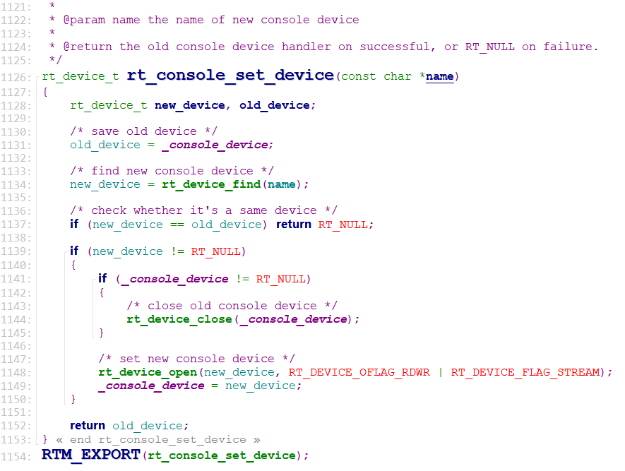
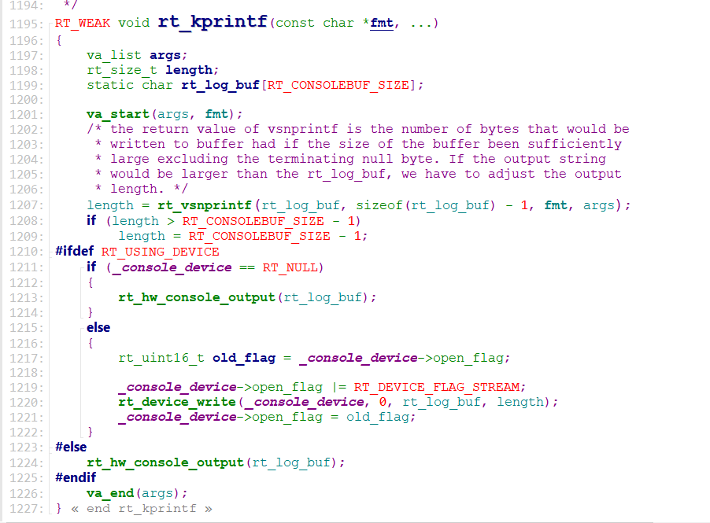
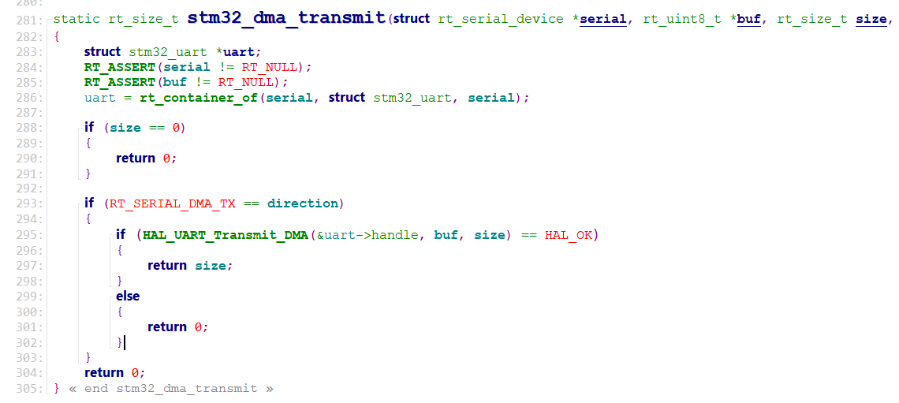

## 工程说明
- USART2的中断接收及轮询发送例程，USART1用于RT-Thread命令交互；使用STM32F411-atk-nano开发板。
- 串口对应管脚：
    - USART1_TX: PA9
    - USART1_RX: PA10
    - USART2_TX: PA2
    - USART2_RX: PA3

## 流程说明
例程默认使用USART1作为console device, 在rt_hw_board_init() -> rt_console_set_device()函数实现console device的绑定，参数使用宏定义*RT_CONSOLE_DEVICE_NAME*，即*usart1*；

程序定义了一个static rt_device_t _console_device = RT_NULL; USART1设备在rt_hw_board_init() -> rt_hw_usart_init()中已进行初始化，所以在rt_console_set_device()函数中调用rt_device_find()查找设备能得到console device。查到之后调用rt_device_open()函数打开该设备， 第二个参数表示以读写方式打开设备，同时以流模式打开设备；
> 默认在rtconfig.h中已定义宏RT_USING_CONSOLE，表示使用console输出功能；

RT-Thread一般调用**rt_kprintf**()函数实现内容输出，具体内容如下图所示：

从图中可以分析出是通过rt_device_write()函数实现内容输出的，该函数属于console device的操作方法，在rt_hw_board_init() -> rt_hw_usart_init() -> rt_hw_serial_register()注册串口设备函数中，将该设备的(*write)方法绑定为rt_serial_write函数，该函数属于RT-Thread的底层硬件驱动函数，位于components/drivers/serial文件夹下的serial.c中。因为UASRT1使用了DMA发送功能，所以在rt_serial_write()中调用_serial_dma_tx()进行发送，再往下一层实际上是调用了struct rt_uart_ops的rt_size_t (*dma_transmit)()回调函数实现DMA方式发送数据，而在RT-Thread提供的驱动库drv_usart.c中实现了该回调函数的内容，即stm32_dma_transmit()函数；

USART2的初始化也是通过rt_hw_usart_init()函数实现的，串口使用默认配置参数115200/8/1/无校验，轮询方式发送最终调用的回调函数为stm32_putc()函数，直接将待发送的数据赋给串口的**DR**寄存器。
> 如果程序中不支持USART2，可以使用**Env**工具，输入*menuconfig*指令，对工程进行配置；USART2属于Hardware Drivers Config -> On-Chip Peripheral Drivers -> Enable UART；